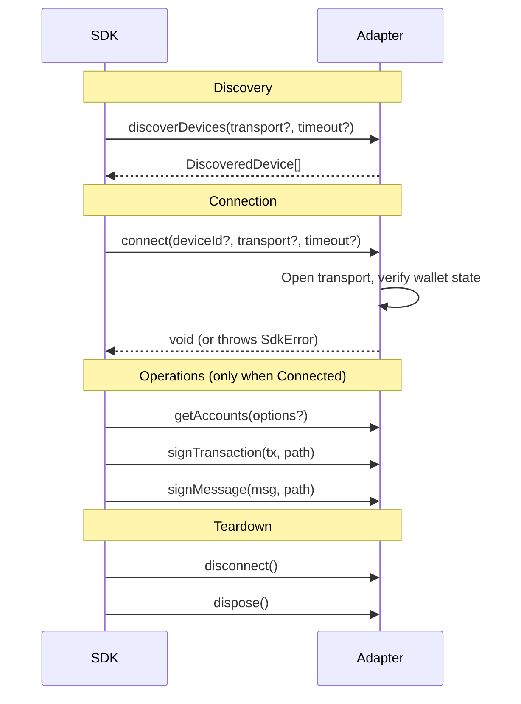
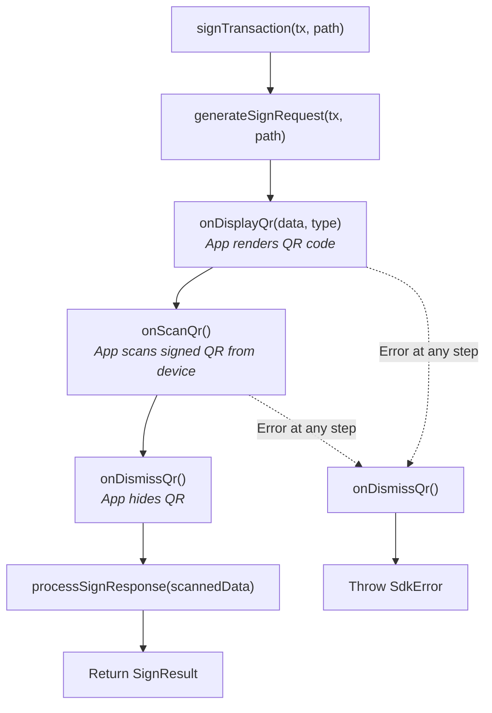
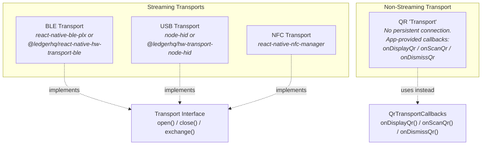
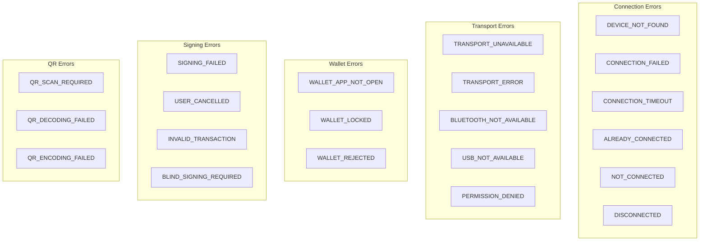
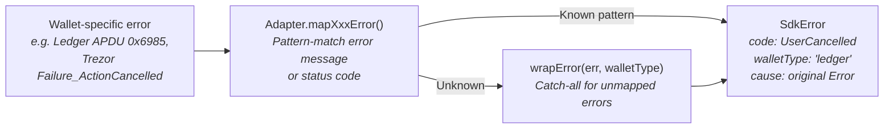

# Adapter Pattern

This document covers the adapter abstraction that forms the extension point of the SDK: how adapters are defined, how QR adapters extend the base interface, how transports are abstracted, and how to implement a new adapter.

## HardwareWalletAdapter Interface

Defined in `packages/core/src/adapter.ts`, this is the contract every hardware wallet must fulfill.

```typescript
interface HardwareWalletAdapter {
  // ── Identity ──
  readonly id: string;                           // e.g. 'ledger', 'trezor'
  readonly name: string;                         // e.g. 'Ledger'
  readonly walletType: WalletType;               // enum: Ledger | Keystone | Trezor | SafePal
  readonly supportedTransports: TransportType[]; // enum[]: BLE | USB | QR | NFC
  readonly features: WalletFeatures;             // capability flags

  // ── State ──
  readonly connectionState: ConnectionState;     // Disconnected | Connecting | Connected | Disconnecting

  // ── Lifecycle ──
  discoverDevices(transport?: TransportType, options?: TimeoutOptions): Promise<DiscoveredDevice[]>;
  connect(deviceId?: string, transport?: TransportType, options?: TimeoutOptions): Promise<void>;
  disconnect(): Promise<void>;
  dispose(): Promise<void>;

  // ── Operations ──
  getAccounts(options?: DerivationOptions): Promise<DerivedAccount[]>;
  signTransaction(transaction: Uint8Array, derivationPath: string): Promise<SignResult>;
  signMessage(message: Uint8Array, derivationPath: string): Promise<SignResult>;
}
```

### Identity Properties

Every adapter declares its identity statically:

| Property | Type | Description |
|----------|------|-------------|
| `id` | `string` | Unique key used by `HardwareWalletSdk` to look up the adapter in its internal `Map<string, HardwareWalletAdapter>`. Must be unique across all registered adapters. |
| `name` | `string` | Display name for UI purposes. |
| `walletType` | `WalletType` | One of `Ledger`, `Keystone`, `Trezor`, `SafePal`. Used in error wrapping to tag which wallet produced an error. |
| `supportedTransports` | `TransportType[]` | Which physical transports this adapter can use. Ledger supports `[BLE, USB]`. Keystone supports `[QR]`. |
| `features` | `WalletFeatures` | Capability flags checked by the SDK before delegating operations. |

### WalletFeatures

```typescript
interface WalletFeatures {
  signMessage: boolean;              // Off-chain message signing
  signTransaction: boolean;          // Legacy transaction signing
  signVersionedTransaction: boolean; // Versioned (v0) transaction signing
  multiAccount: boolean;             // Multiple account derivation
  blindSigning: boolean;             // Whether blind signing is needed/supported
}
```

The SDK checks these flags before calling adapter methods. For example, calling `sdk.signMessage()` when the active adapter has `features.signMessage === false` throws `SdkError(SdkErrorCode.UnsupportedFeature)` without ever reaching the adapter.

### Lifecycle Methods



**`discoverDevices()`** returns available devices without establishing a connection. For BLE/USB wallets, this involves scanning. For QR wallets, it returns a synthetic device descriptor since QR wallets are always "discoverable."

**`connect()`** establishes the connection. The adapter is responsible for:
1. Obtaining or creating a transport (BLE connection, USB handle, or QR account sync)
2. Verifying the wallet is in a usable state (correct app open, device unlocked)
3. Setting `connectionState` to `Connected` on success, `Disconnected` on failure

**`disconnect()`** closes the transport and clears internal state. Must be safe to call multiple times.

**`dispose()`** calls `disconnect()` if connected, then releases any resources. After `dispose()`, the adapter instance should not be reused.

## QrWalletAdapter Extension

QR-based wallets (Keystone, SafePal) extend the base interface with QR-specific methods:

```typescript
interface QrWalletAdapter extends HardwareWalletAdapter {
  generateSignRequest(transaction: Uint8Array, derivationPath: string): Promise<QrSignRequest>;
  processSignResponse(qrData: string): Promise<SignResult>;
  generateAccountSyncRequest?(): Promise<QrSyncRequest>;
  processAccountSyncResponse?(qrData: string): Promise<DerivedAccount[]>;
}
```

### QR Data Types

```typescript
interface QrSignRequest {
  data: string;  // Encoded payload (UR string, hex, or wallet-specific format)
  type: string;  // Format identifier, e.g. 'ur:sol-sign-request'
}

interface QrSyncRequest {
  data: string;
  type: string;
}
```

### Type Guard

The SDK provides a type guard to check if an adapter supports QR flows:

```typescript
function isQrAdapter(adapter: HardwareWalletAdapter): adapter is QrWalletAdapter {
  return 'generateSignRequest' in adapter && 'processSignResponse' in adapter;
}
```

### How QR Signing Differs

In BLE/USB adapters, `signTransaction()` sends bytes over a transport and receives a response. In QR adapters, `signTransaction()` orchestrates a multi-step flow using `QrTransportCallbacks`:



The `QrTransportCallbacks` interface (from `@solana-hw-wallet/transports`) must be provided by the app at adapter construction time. The adapter never renders UI itself -- it delegates all display and scanning to the app through these callbacks.

## Transport Abstraction Design

### Transport Interface

Defined in `packages/transports/src/index.ts`, the `Transport` interface abstracts byte-level communication:

```typescript
interface Transport {
  readonly type: TransportType;
  readonly isOpen: boolean;
  open(options?: TimeoutOptions): Promise<void>;
  close(): Promise<void>;
  exchange(data: Uint8Array, options?: TimeoutOptions): Promise<Uint8Array>;
}
```

This is a request-response abstraction matching protocols like APDU (Ledger) and Protobuf over HID (Trezor). The `exchange()` method sends a payload and returns the response.

### TransportFactory Interface

```typescript
interface TransportFactory {
  readonly type: TransportType;
  isAvailable(): Promise<boolean>;
  discover(options?: TimeoutOptions): Promise<TransportDeviceDescriptor[]>;
  create(deviceId: string, options?: TimeoutOptions): Promise<Transport>;
}
```

A factory handles platform detection (`isAvailable()`), device scanning (`discover()`), and transport instantiation (`create()`).

### Transport Types



QR is not a true transport in the `exchange()` sense. QR wallets bypass the `Transport` interface entirely and use `QrTransportCallbacks` instead. This is intentional: the air-gapped QR flow has fundamentally different semantics (no persistent connection, human in the loop, asynchronous scan).

### Platform-Specific Configuration

Each transport type has a config interface for platform-specific parameters:

| Config | Key Parameters |
|--------|---------------|
| `BleTransportConfig` | `serviceUuids` (wallet-specific BLE service UUIDs), `scanDurationMs` |
| `UsbTransportConfig` | `vendorIds`, `productIds` (USB HID device filters) |
| `NfcTransportConfig` | `technology` (NFC technology type) |
| `QrTransportCallbacks` | `onDisplayQr`, `onScanQr`, `onDismissQr` (app-provided functions) |

### How Adapters Use Transports

The current adapters do not consume the `Transport` interface directly. Instead, they accept wallet-vendor transport libraries:

- **Ledger**: Accepts `LedgerTransportLike` (matching `@ledgerhq/hw-transport`'s `send`/`close` API) or a `transportFactory` that creates one. The Ledger transport is then wrapped with `@ledgerhq/hw-app-solana` to get the `SolanaApp` high-level API.
- **Trezor**: Uses `@trezor/connect` which manages its own transport internally. The adapter calls `trezorConnect.init()` and then high-level methods like `solanaGetAddress` and `solanaSignTransaction`.
- **Keystone/SafePal**: Accept `QrTransportCallbacks` for the QR display/scan cycle. No streaming transport is involved.

The `Transport` and `TransportFactory` interfaces in the `transports` package serve as the abstraction layer for future custom transport implementations. An adapter could accept a `TransportFactory` to discover and connect to devices in a platform-agnostic way.

## Error Mapping Strategy

The SDK normalizes all wallet-specific errors into a single `SdkError` class with an `SdkErrorCode` enum. This gives consumers a consistent error handling API regardless of which wallet is connected.

### SdkError Class

```typescript
class SdkError extends Error {
  readonly code: SdkErrorCode;    // Normalized error code
  readonly walletType?: string;    // Which wallet produced the error
  readonly cause?: Error;          // Original error from the wallet library

  get isCancellation(): boolean;   // True for UserCancelled or WalletRejected
  get isRecoverable(): boolean;    // True for timeouts, disconnects, locked wallet, etc.
}
```

### Error Code Categories



### Error Wrapping Flow



Each adapter implements a private `mapXxxError()` method that pattern-matches on error messages and status codes. The patterns are wallet-specific:

**Ledger** matches APDU status word hex codes (`0x6985`, `0x6d00`, `0x6e00`, `0x6a80`) and known error message substrings (`"denied"`, `"blind signing"`, `"disconnected"`).

**Trezor** matches Trezor Connect error codes (`Failure_ActionCancelled`) and message substrings (`"PIN"`, `"locked"`, `"not connected"`).

**Keystone/SafePal** match on generic substrings (`"cancel"`, `"reject"`).

If no pattern matches, the adapter falls through to `wrapError()`, which wraps any unknown error as `SdkError(SdkErrorCode.Unknown)`, preserving the original error as `cause`.

### Recoverable vs. Fatal Errors

The `SdkError.isRecoverable` property returns `true` for errors where retrying or reconnecting may succeed:

- `ConnectionTimeout` / `Timeout` -- retry may work
- `Disconnected` -- reconnect may work
- `WalletAppNotOpen` -- user can open the app and retry
- `WalletLocked` -- user can unlock and retry
- `BlindSigningRequired` -- user can enable the setting and retry

The `SdkError.isCancellation` property returns `true` for `UserCancelled` and `WalletRejected`, which represent intentional user actions and should not trigger retry logic.

## How to Implement a New Adapter

This section walks through implementing a hypothetical adapter for a new wallet.

### Step 1: Create the Package

Create `packages/adapter-mywallet/` with this dependency structure in `package.json`:

```json
{
  "name": "@solana-hw-wallet/adapter-mywallet",
  "dependencies": {
    "@solana-hw-wallet/core": "workspace:*",
    "@solana-hw-wallet/shared": "workspace:*",
    "@solana-hw-wallet/solana": "workspace:*",
    "@solana-hw-wallet/transports": "workspace:*"
  }
}
```

### Step 2: Implement the Interface

For a BLE/USB wallet, implement `HardwareWalletAdapter`:

```typescript
import type { HardwareWalletAdapter } from '@solana-hw-wallet/core';
import { SdkError, SdkErrorCode, wrapError } from '@solana-hw-wallet/core';
import {
  ConnectionState, TransportType, WalletType,
  type DerivedAccount, type DerivationOptions, type DiscoveredDevice,
  type SignResult, type TimeoutOptions, type WalletFeatures,
} from '@solana-hw-wallet/shared';
import { getSolanaDerivationPath } from '@solana-hw-wallet/solana';

export class MyWalletAdapter implements HardwareWalletAdapter {
  readonly id = 'mywallet';
  readonly name = 'MyWallet';
  readonly walletType = WalletType.Ledger; // or add a new WalletType
  readonly supportedTransports = [TransportType.USB];
  readonly features: WalletFeatures = {
    signMessage: true,
    signTransaction: true,
    signVersionedTransaction: false,
    multiAccount: true,
    blindSigning: false,
  };

  private _connectionState = ConnectionState.Disconnected;

  get connectionState() { return this._connectionState; }

  async discoverDevices(transport?: TransportType, options?: TimeoutOptions): Promise<DiscoveredDevice[]> {
    // Return available devices. For simple cases, return a synthetic descriptor.
    return [{ id: 'mywallet-1', name: 'MyWallet', walletType: this.walletType, transport: TransportType.USB }];
  }

  async connect(deviceId?: string, transport?: TransportType, options?: TimeoutOptions): Promise<void> {
    this._connectionState = ConnectionState.Connecting;
    try {
      // 1. Obtain transport (dynamic import vendor SDK, open USB/BLE, etc.)
      // 2. Verify wallet state (app open, device unlocked)
      // 3. Set connected
      this._connectionState = ConnectionState.Connected;
    } catch (err) {
      this._connectionState = ConnectionState.Disconnected;
      throw wrapError(err);
    }
  }

  async disconnect(): Promise<void> {
    // Close transport, clear state
    this._connectionState = ConnectionState.Disconnected;
  }

  async getAccounts(options?: DerivationOptions): Promise<DerivedAccount[]> {
    this.ensureConnected();
    const count = options?.count ?? 1;
    const startIndex = options?.startIndex ?? options?.accountIndex ?? 0;
    // Derive accounts using vendor SDK + getSolanaDerivationPath()
    // ...
    return [];
  }

  async signTransaction(transaction: Uint8Array, derivationPath: string): Promise<SignResult> {
    this.ensureConnected();
    try {
      // Send transaction to device, receive signature
      // ...
      return { signature: new Uint8Array(64) };
    } catch (err) {
      throw this.mapError(err, 'Transaction signing failed');
    }
  }

  async signMessage(message: Uint8Array, derivationPath: string): Promise<SignResult> {
    this.ensureConnected();
    // Similar to signTransaction
    return { signature: new Uint8Array(64) };
  }

  async dispose(): Promise<void> {
    if (this._connectionState !== ConnectionState.Disconnected) {
      await this.disconnect();
    }
  }

  private ensureConnected(): void {
    if (this._connectionState !== ConnectionState.Connected) {
      throw new SdkError(SdkErrorCode.NotConnected, 'MyWallet is not connected');
    }
  }

  private mapError(err: unknown, context: string): SdkError {
    // Map vendor-specific errors to SdkErrorCode values
    const message = err instanceof Error ? err.message : String(err);
    const cause = err instanceof Error ? err : undefined;

    if (message.includes('rejected')) {
      return new SdkError(SdkErrorCode.UserCancelled, 'User rejected on MyWallet', { cause });
    }

    return new SdkError(SdkErrorCode.Unknown, `${context}: ${message}`, { cause });
  }
}
```

### Step 3: For QR Wallets, Implement QrWalletAdapter

If the wallet uses QR codes, implement `QrWalletAdapter` instead and accept `QrTransportCallbacks`:

```typescript
import type { QrWalletAdapter, QrSignRequest } from '@solana-hw-wallet/core';
import type { QrTransportCallbacks } from '@solana-hw-wallet/transports';

export class MyQrWalletAdapter implements QrWalletAdapter {
  // ... all HardwareWalletAdapter methods, plus:

  private qrCallbacks: QrTransportCallbacks;

  async generateSignRequest(transaction: Uint8Array, derivationPath: string): Promise<QrSignRequest> {
    // Encode transaction into wallet-specific QR format
    return { data: '...', type: 'mywallet:sign-request' };
  }

  async processSignResponse(qrData: string): Promise<SignResult> {
    // Decode scanned QR data into a signature
    return { signature: new Uint8Array(64) };
  }

  async signTransaction(transaction: Uint8Array, derivationPath: string): Promise<SignResult> {
    const qr = await this.generateSignRequest(transaction, derivationPath);
    this.qrCallbacks.onDisplayQr(qr.data, qr.type);
    const scannedData = await this.qrCallbacks.onScanQr();
    this.qrCallbacks.onDismissQr();
    return this.processSignResponse(scannedData);
  }
}
```

### Step 4: Register with the SDK

```typescript
import { createHardwareWalletSdk } from '@solana-hw-wallet/core';
import { MyWalletAdapter } from '@solana-hw-wallet/adapter-mywallet';

const sdk = createHardwareWalletSdk({
  adapters: [new MyWalletAdapter()],
});

// Use with React Native
<HardwareWalletProvider sdk={sdk}>
  <App />
</HardwareWalletProvider>
```

### Implementation Checklist

- [ ] Implement all `HardwareWalletAdapter` methods (or `QrWalletAdapter` for QR wallets)
- [ ] Set `features` flags accurately -- the SDK trusts these for feature gating
- [ ] Manage `connectionState` transitions correctly: `Disconnected -> Connecting -> Connected` on success, `Connecting -> Disconnected` on failure
- [ ] Use dynamic imports for vendor SDKs to avoid hard dependencies
- [ ] Implement `mapError()` to translate wallet-specific errors to `SdkErrorCode` values
- [ ] Preserve the original error as `cause` in `SdkError` for debugging
- [ ] Use `getSolanaDerivationPath()` from `@solana-hw-wallet/solana` for BIP44 path construction
- [ ] Make `dispose()` safe to call multiple times
- [ ] Add the adapter package to the monorepo's `pnpm-workspace.yaml`
- [ ] Use `MockAdapter` from `@solana-hw-wallet/test-utils` as a reference implementation

### Testing with MockAdapter

The `@solana-hw-wallet/test-utils` package provides `MockAdapter` with configurable behavior:

```typescript
import { MockAdapter } from '@solana-hw-wallet/test-utils';
import { SdkError, SdkErrorCode } from '@solana-hw-wallet/core';

const mock = new MockAdapter({
  behavior: {
    delayMs: 100,                    // Simulate device latency
    rejectSigning: false,            // Simulate user rejection
    connectError: undefined,         // Simulate connection failure
    accounts: [/* custom accounts */],
    signature: new Uint8Array(64),   // Custom signature bytes
  },
});

// Track calls for assertions
mock.calls; // [{ method: 'connect', args: [...] }, ...]

// Change behavior mid-test
mock.setBehavior({ rejectSigning: true });
```

`MockAdapter` follows the exact same interface contract as real adapters, making it the canonical reference for how an adapter should behave.
