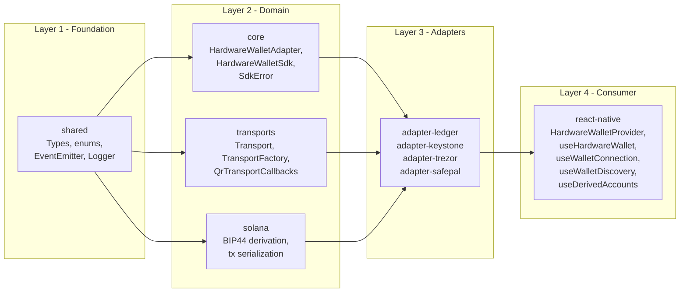
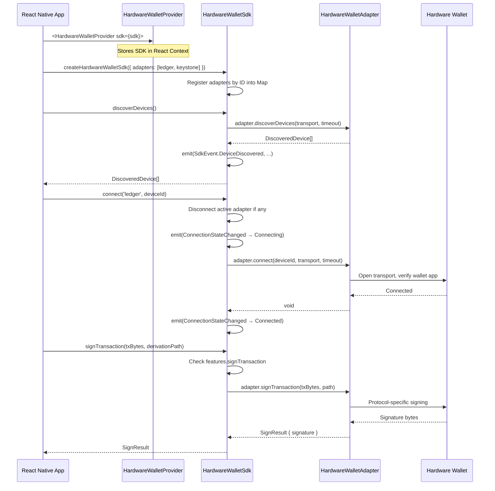
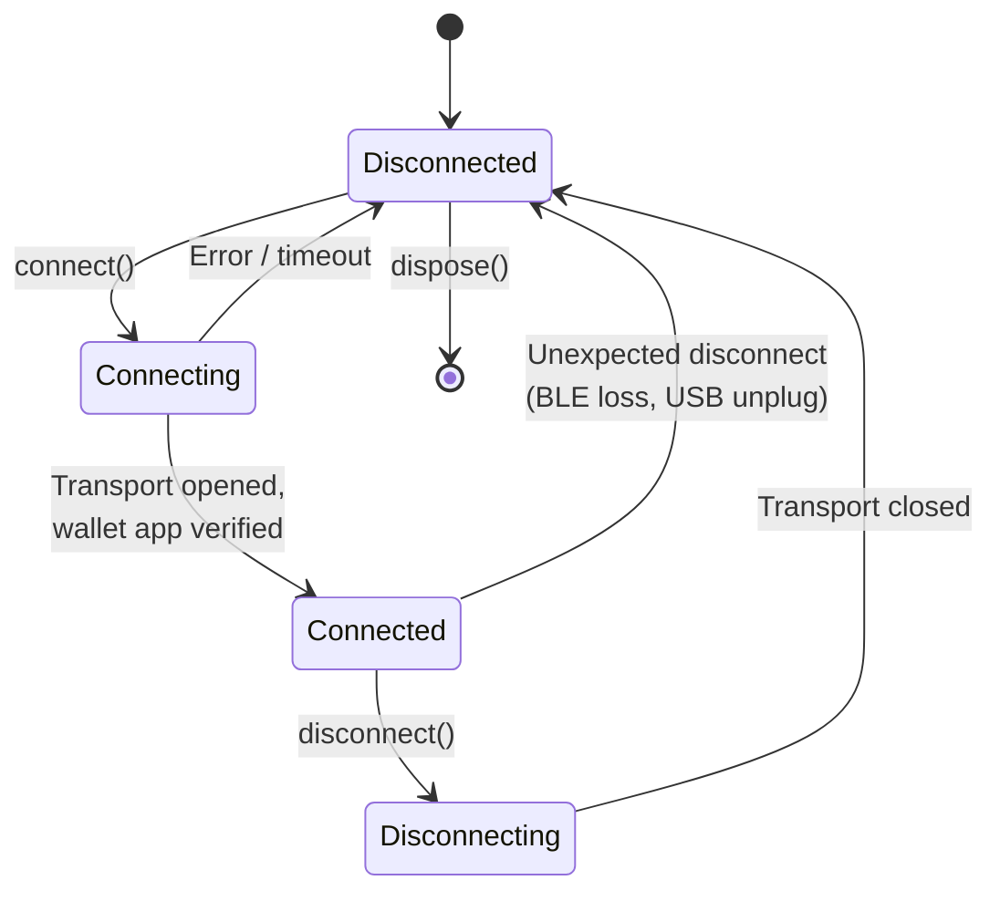
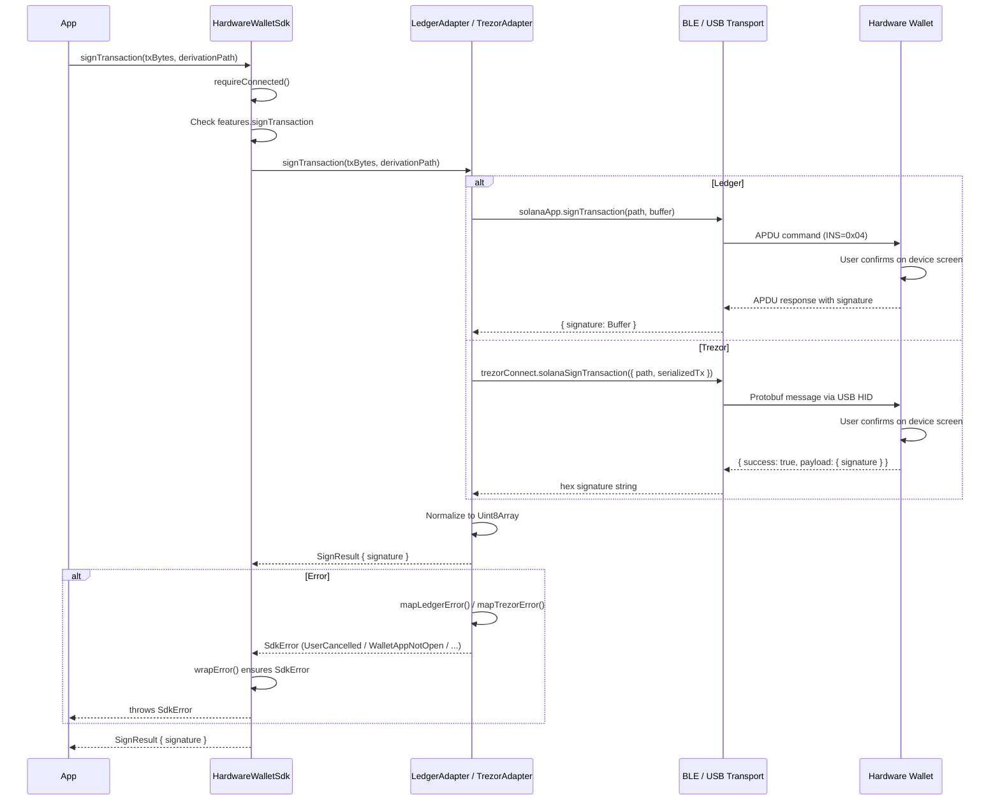
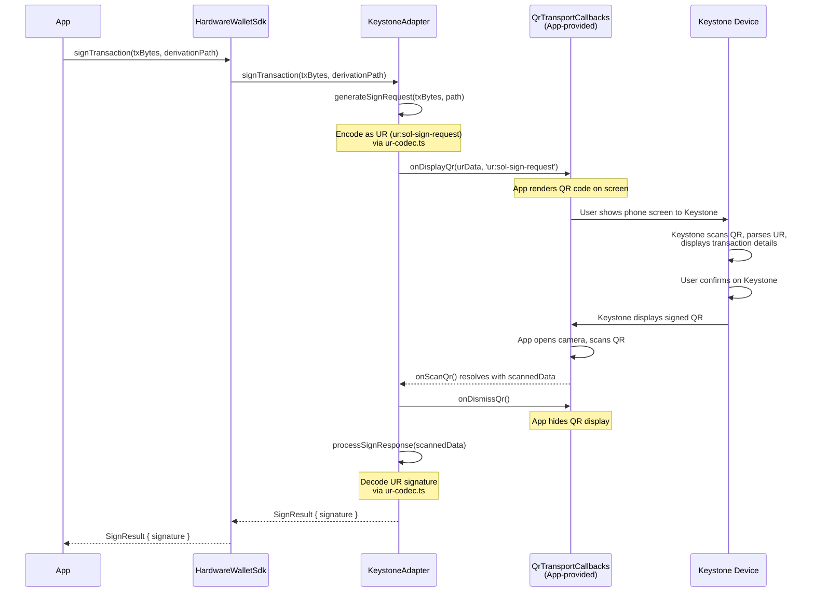
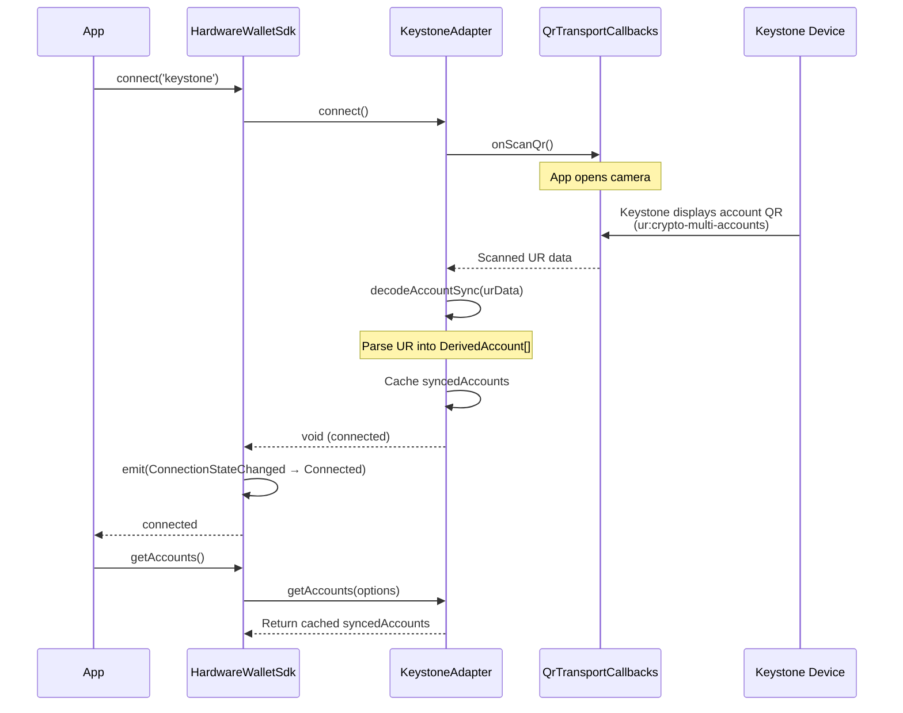
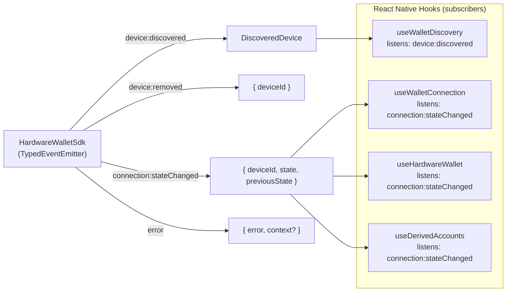
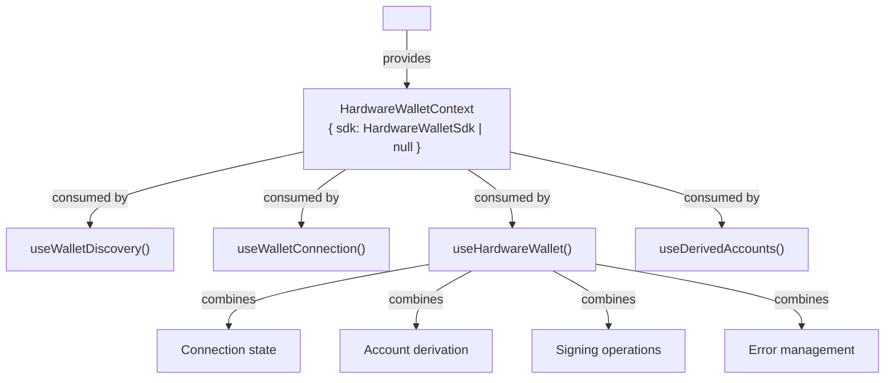

# Architecture Overview

This document describes the architecture of the Solana Hardware Wallet SDK monorepo: a layered, adapter-based system for interacting with hardware wallets (Ledger, Trezor, Keystone, SafePal) from React Native and Node.js applications.

## Package Dependency Graph

The monorepo is organized into four tiers: shared foundations, domain logic, wallet-specific adapters, and the consumer-facing React Native layer.

```mermaid
graph TD
    shared["@solana-hw-wallet/shared<br/><i>Types, enums, event emitter</i>"]

    core["@solana-hw-wallet/core<br/><i>Adapter interface, SDK class, errors</i>"]
    solana["@solana-hw-wallet/solana<br/><i>Derivation paths, tx helpers</i>"]
    transports["@solana-hw-wallet/transports<br/><i>Transport abstractions</i>"]

    ledger["@solana-hw-wallet/adapter-ledger<br/><i>Ledger BLE/USB</i>"]
    keystone["@solana-hw-wallet/adapter-keystone<br/><i>Keystone QR</i>"]
    trezor["@solana-hw-wallet/adapter-trezor<br/><i>Trezor USB</i>"]
    safepal["@solana-hw-wallet/adapter-safepal<br/><i>SafePal QR (partial)</i>"]

    rn["@solana-hw-wallet/react-native<br/><i>Provider, hooks</i>"]
    testutils["@solana-hw-wallet/test-utils<br/><i>MockAdapter, test SDK</i>"]

    core --> shared
    solana --> shared
    transports --> shared

    ledger --> core
    ledger --> shared
    ledger --> solana
    ledger --> transports

    keystone --> core
    keystone --> shared
    keystone --> solana
    keystone --> transports

    trezor --> core
    trezor --> shared
    trezor --> solana
    trezor --> transports

    safepal --> core
    safepal --> shared
    safepal --> solana
    safepal --> transports

    rn --> core
    rn --> shared
    rn --> solana
    rn --> transports

    testutils --> core
    testutils --> shared
    testutils --> solana
    testutils --> transports

    style shared fill:#e8f5e9,stroke:#2e7d32
    style core fill:#e3f2fd,stroke:#1565c0
    style solana fill:#e3f2fd,stroke:#1565c0
    style transports fill:#e3f2fd,stroke:#1565c0
    style ledger fill:#fff3e0,stroke:#e65100
    style keystone fill:#fff3e0,stroke:#e65100
    style trezor fill:#fff3e0,stroke:#e65100
    style safepal fill:#fff3e0,stroke:#e65100
    style rn fill:#fce4ec,stroke:#b71c1c
    style testutils fill:#f3e5f5,stroke:#6a1b9a
```

**Dependency rule:** arrows point from dependant to dependency. Every adapter depends on `core`, `shared`, `solana`, and `transports`. The `core` package depends only on `shared`. The `react-native` package depends on the core layer but never on specific adapters -- adapters are injected at runtime.

## SDK Layer Architecture

The SDK is structured in concentric layers. Each layer has a single responsibility and communicates only with its immediate neighbors.

| Layer | Package(s) | Responsibility |
|-------|-----------|----------------|
| Foundation | `shared` | Zero-dependency base: `WalletType`, `TransportType`, `ConnectionState` enums; `TypedEventEmitter`; `Logger` interface; all shared TS interfaces (`DiscoveredDevice`, `DerivedAccount`, `SignResult`, etc.) |
| Domain | `core`, `solana`, `transports` | `core` defines the `HardwareWalletAdapter` interface, `QrWalletAdapter` extension, `HardwareWalletSdk` orchestrator, and `SdkError` hierarchy. `solana` provides BIP44 derivation path construction/parsing and `@solana/web3.js` transaction serialization helpers. `transports` defines `Transport` and `TransportFactory` interfaces plus config types for BLE, USB, QR, and NFC. |
| Adapters | `adapter-*` | Each adapter implements `HardwareWalletAdapter` (or `QrWalletAdapter`) for a specific wallet. Adapters own wallet-specific protocol logic: APDU commands for Ledger, `@trezor/connect` for Trezor, UR codec for Keystone. |
| Consumer | `react-native` | React context provider and hooks that wrap the SDK for declarative use in React Native apps. Manages React state, lifecycle subscriptions, and loading/error states. |

## Adapter Pattern Flow

The SDK uses dependency inversion: the `HardwareWalletSdk` class operates exclusively through the `HardwareWalletAdapter` interface. Concrete adapters are injected at construction time.

## Connection Lifecycle State Machine

Every adapter tracks a `ConnectionState` enum. The SDK emits `ConnectionStateChanged` events on every transition and ensures only one adapter is active at a time.

**State transitions in the SDK:**

1. `connect(adapterId, deviceId)` -- SDK sets state to `Connecting`, delegates to the adapter. On success, state becomes `Connected`. On failure, state reverts to `Disconnected`.
2. `disconnect()` -- SDK sets state to `Disconnecting` (adapter-side), calls `adapter.disconnect()`, then sets `Disconnected`.
3. Calling `connect()` while another adapter is active automatically calls `disconnect()` on the previous adapter first.
4. `dispose()` disconnects the active adapter, disposes all registered adapters, clears the adapter map, and removes all event listeners.

**QR wallets (Keystone, SafePal) have a different notion of "connected":** they perform an account sync via QR scan during `connect()`. There is no persistent transport -- the "connected" state means "accounts have been synced and are cached." Each signing operation initiates a new QR display/scan cycle.

## Signing Flow: BLE/USB Wallets (Ledger, Trezor)

For wallets with persistent transport connections, signing is a direct request-response over the transport.

### Ledger error mapping

The `LedgerAdapter.mapLedgerError()` method translates Ledger APDU status codes to SDK error codes:

| APDU Status | SDK Error Code | Meaning |
|-------------|---------------|---------|
| `0x6985` | `UserCancelled` | User denied the request on device |
| `0x6d00` | `WalletAppNotOpen` | Solana app is not open |
| `0x6e00` | `WalletAppNotOpen` | Wrong app open |
| `0x6a80` | `BlindSigningRequired` | Blind signing not enabled in settings |

### Trezor error mapping

The `TrezorAdapter.mapTrezorError()` method translates Trezor Connect failure codes:

| Trezor Code | SDK Error Code | Meaning |
|-------------|---------------|---------|
| `Failure_ActionCancelled` | `UserCancelled` | User cancelled on device |
| Contains "PIN" / "locked" | `WalletLocked` | Device is locked |
| Contains "disconnected" | `Disconnected` | USB connection lost |

## Signing Flow: QR-Based Wallets (Keystone, SafePal)

QR wallets operate without a persistent transport. Each signing operation is a multi-step QR exchange between the app and the air-gapped device.

**QR encoding standards:**

| Wallet | QR Format | Sign Request Type | Sign Response Type |
|--------|-----------|------------------|-------------------|
| Keystone | Blockchain Commons UR | `ur:sol-sign-request` | `ur:sol-signature` |
| SafePal | Proprietary (undocumented) | `safepal:sol-sign-request` | Proprietary |

The `QrTransportCallbacks` interface (defined in `@solana-hw-wallet/transports`) is the bridge between the SDK and the app's QR UI. The app must implement three callbacks:

- `onDisplayQr(data, type)` -- render a QR code containing `data`
- `onScanQr()` -- open a camera scanner and return the scanned string
- `onDismissQr()` -- hide the QR display

This design keeps the SDK free of any UI framework dependency. The app provides the QR rendering and scanning implementation appropriate for its platform (React Native camera libraries, web canvas, etc.).

## Account Sync Flow (QR Wallets)

For QR wallets, `connect()` performs an account sync rather than opening a transport:

After account sync, `getAccounts()` returns the cached accounts without any further QR interaction.

## Event System

The SDK extends `TypedEventEmitter<SdkEventMap>` and emits strongly-typed events:

Each hook subscribes via `sdk.on(event, handler)` in a `useEffect` and returns the unsubscribe function as the cleanup. The `TypedEventEmitter` class provides type-safe event emission and subscription, with listener errors silently caught to avoid breaking the emitter chain.

## React Native Integration

The React Native layer provides a context-based API:

| Hook | Purpose | Reactive State |
|------|---------|---------------|
| `useWalletDiscovery` | Scan for available devices | `devices`, `isDiscovering`, `error` |
| `useWalletConnection` | Connect/disconnect lifecycle | `connectionState`, `isConnecting`, `isConnected`, `error` |
| `useHardwareWallet` | All-in-one wallet interaction | Connection + accounts + signing + errors |
| `useDerivedAccounts` | Account derivation with auto-load on connect | `accounts`, `isLoading`, `error` |

All hooks throw if used outside `<HardwareWalletProvider>`, enforced by `useHardwareWalletContext()`.

## External Dependencies

The SDK uses dynamic imports for wallet-specific libraries to avoid hard dependencies:

| Adapter | Dynamic Import | Purpose |
|---------|---------------|---------|
| Ledger | `@ledgerhq/hw-app-solana` | Solana APDU commands |
| Trezor | `@trezor/connect` | Trezor Connect API |
| Keystone | `./ur-codec.js` (wraps `@keystonehq/sol-keyring`, `@ngraveio/bc-ur`) | UR encoding/decoding |
| SafePal | None (proprietary protocol, not yet available) | -- |

This means an app that only uses the Ledger adapter does not need `@trezor/connect` installed, and vice versa.
